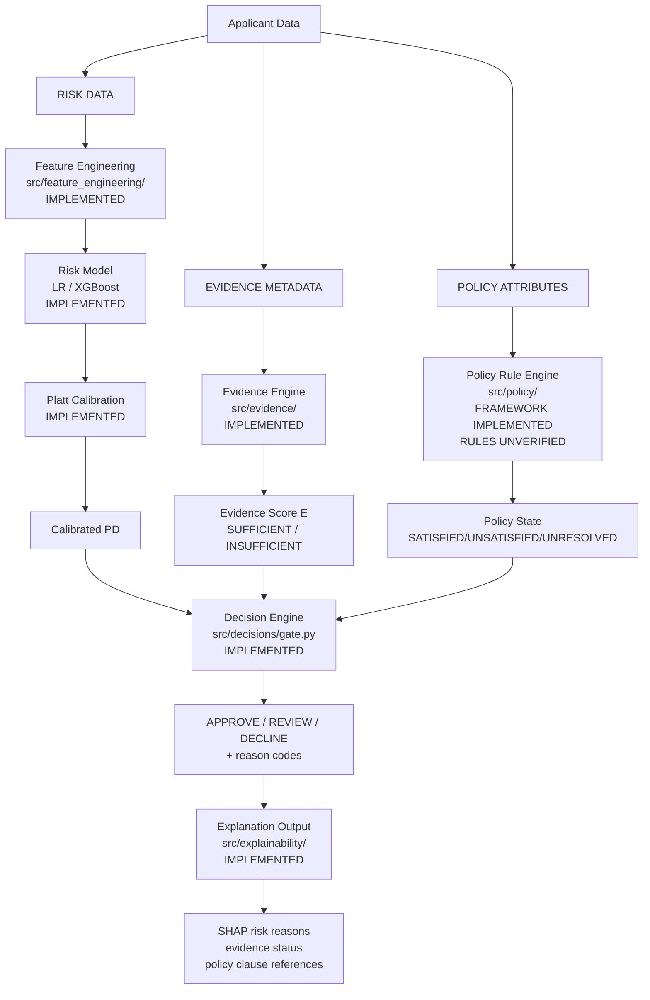
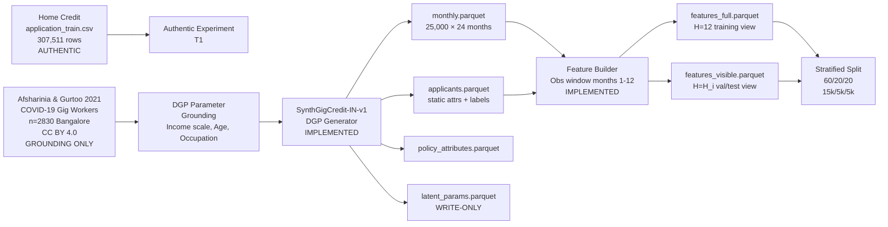
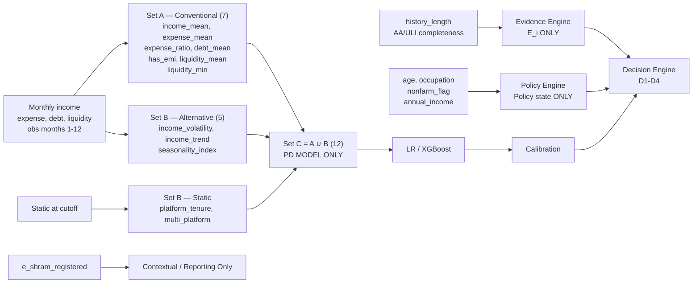
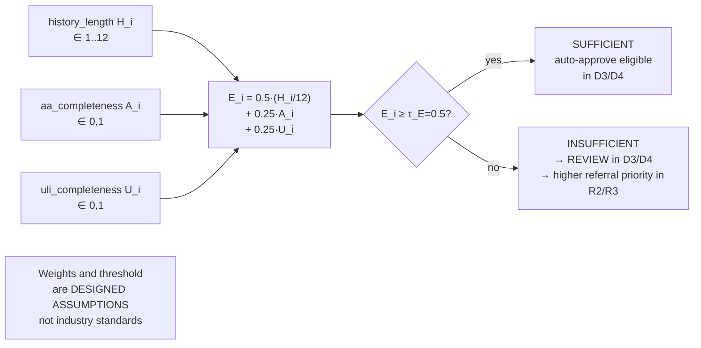
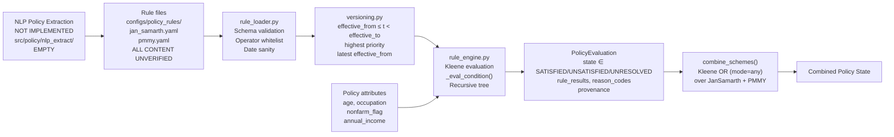
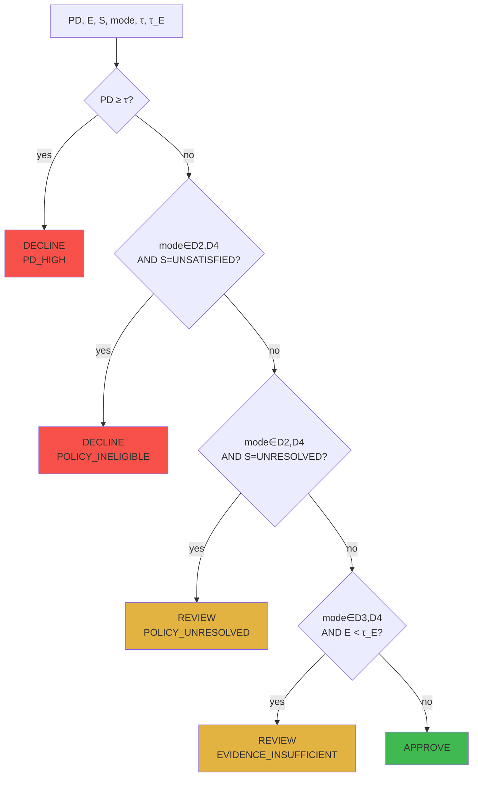
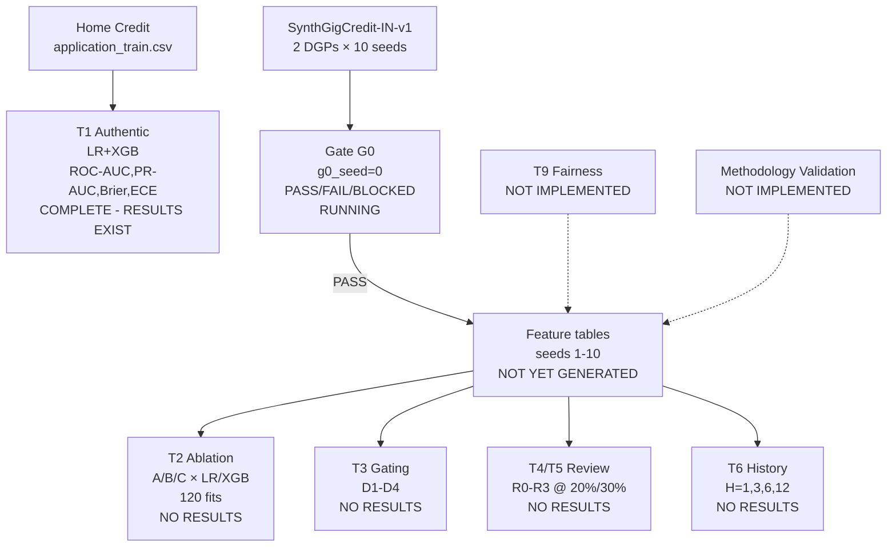
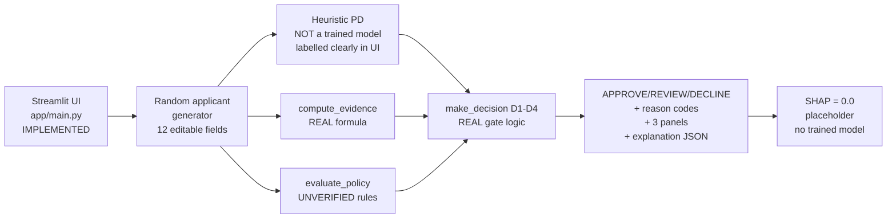

# FINAL PROJECT ARCHITECTURE
## Policy-Constrained Credit Decisioning with Evidence-Quality Gating for Thin-File Gig/Platform Workers
**Version 1.2 — Architecture Reconstruction (2026-09-22)**
**Source of truth: repository at `c:\Users\DELL\Desktop\ml-project`**

---

## WHAT EXACTLY ARE WE BUILDING?

A **credit decision pipeline** for thin-file gig/platform workers with three deliberately separate layers:

1. A **calibrated ML risk model** (Logistic Regression + XGBoost) that outputs a probability of default from 12 financial/gig-worker features.
2. An **evidence-quality layer** that scores whether available history and data completeness are sufficient to trust the ML estimate.
3. A **policy rule engine** that evaluates JanSamarth/PMMY government-scheme eligibility from manually transcribed, versioned rules using Kleene three-valued logic.

A **decision engine** combines them into APPROVE / REVIEW / DECLINE with reason codes. A **review-allocation experiment** tests fixed human-review budgets (20%/30%). The pipeline is validated on the Home Credit authentic credit-risk benchmark; integration is tested on a controlled synthetic longitudinal dataset (SynthGigCredit-IN-v1).

```
RISK  ≠  EVIDENCE QUALITY  ≠  POLICY ELIGIBILITY
```

**The old EDI project (FastAPI + React) has been completely removed. This is a pure research prototype.**

---

## PROJECT STATUS AND COMPLETION

### Overall Status: **RESEARCH PROTOTYPE — FUNCTIONAL CORE, SYNTHETIC EXPERIMENTS PENDING**

### Overall Completion: **72%**
**Confidence: HIGH** (derived from weighted breakdown below; all code was inspected)

### Weighted Completion Breakdown

| Area | Weight | Completion | Evidence | Status |
|---|---|---|---|---|
| Repository setup | 5% | 100% | Makefile, setup.py, requirements.txt, full directory tree, __init__.py throughout | ✅ Complete |
| Data pipeline (authentic + synthetic generator) | 12% | 80% | DGP fully implemented; g0_seed=0 data generated; seeds 1–10 NOT generated yet | ⚠️ Partial |
| Feature engineering | 10% | 100% | All 23 columns, 6 views, exact formulas, NaN rules — 69 tests pass | ✅ Complete |
| ML model implementation | 10% | 100% | LR + XGBoost with full preprocessing pipelines, feature-set assertions | ✅ Complete |
| Model evaluation and calibration | 8% | 90% | Platt calibration, all metrics implemented; T1 authentic results exist; synthetic T2–T6 results not yet generated | ⚠️ Partial |
| Evidence-quality layer | 8% | 100% | Formula, threshold, states, NaN handling — fully tested | ✅ Complete |
| Policy engine | 8% | 70% | Framework (Kleene, loader, versioning, rule_engine) fully implemented; rule CONTENT is UNVERIFIED placeholder (Task 10b incomplete) | ⚠️ Partial |
| Decision engine | 8% | 100% | D1–D4 gating, τ selection, matched-coverage, review allocation R0–R3 — fully tested | ✅ Complete |
| Full-stack application (Streamlit demo) | 5% | 75% | Demo runs; uses heuristic PD (no trained model loaded); full three-layer display works | ⚠️ Partial |
| API and database | 0% | N/A | No REST API or database — pure research pipeline (not in scope) | N/A |
| Experiments and results | 12% | 35% | T1 (authentic) complete with results; T2–T6 code written but no results (synthetic data not generated at scale) | ⚠️ Partial |
| Testing and validation | 7% | 55% | 69 unit tests pass for DGP, features, evidence, policy, decisions; no tests for calibration, models, metrics, SHAP, review | ⚠️ Partial |
| Documentation and PPT-readiness | 7% | 80% | README, dataset2_freeze.md, policy_rule_verification.md; this file; no final PPT | ⚠️ Partial |

**Overall: (5×1.00 + 12×0.80 + 10×1.00 + 10×1.00 + 8×0.90 + 8×1.00 + 8×0.70 + 8×1.00 + 5×0.75 + 0 + 12×0.35 + 7×0.55 + 7×0.80) / 100 = ~72%**

### Status Caveat
This is an engineering estimate based on repository inspection (file existence, code tracing, test results, result artifacts). It is not a formal project-management measurement. The largest gap is the absence of synthetic experiment results (T2–T6), which requires generating seeds 1–10 and running the experiment pipeline — mechanically straightforward but time-consuming.

---

## TWO PROJECT TRACKS

### Track A — Research/Experimental Pipeline [PRIMARY]
The full ML + evidence + policy pipeline implemented in `src/`. Experiments defined in `experiments/`. Results saved to `results/`. This is the primary deliverable.

**Status: Functional prototype. T1 results verified. T2–T6 code complete, no results.**

### Track B — Full-Stack Application / MVP
The Streamlit demo in `app/main.py`. A thin UI on top of Track A components.

**Status: Functional with heuristic PD. Requires a trained model saved to disk for real PD display.**

### RESEARCH MODEL VS MVP MODEL

| Aspect | Research Pipeline (Track A) | Streamlit Demo (Track B) |
|---|---|---|
| Dataset | Home Credit (T1) + SynthGigCredit-IN-v1 (T2–T6) | Synthetic random applicant (generated on-the-fly) |
| Model | LR / XGBoost trained on feature set A/B/C | **Heuristic PD** (`0.05 + 0.3·max(0,er−0.5) + 0.2·vol + 0.1·max(0,−lr)`) — not a real model |
| Feature schema | 12 features from set C (SynthGigCredit-IN-v1) | Same 12 features, but values from random applicant generator |
| Target | `default_flag` from structural liquidity mechanism | N/A — no labels |
| Training | `train_model()` via `experiments/*/run.py` | Not trained — heuristic only |
| Calibration | Platt on validation set | None |
| Evidence layer | `compute_evidence()` — formula-based | Same `compute_evidence()` — real formula |
| Policy layer | `evaluate_policy()` on UNVERIFIED fixtures | Same `evaluate_policy()` — same UNVERIFIED fixtures |
| Decision engine | `make_decision()` D1–D4 | Same `make_decision()` — real gate logic |
| Explainability | TreeSHAP on XGB-C (not yet run) | Hardcoded SHAP=0.0 placeholder |
| Completion status | 72% overall | 75% (demo works; PD is heuristic) |

---

## COMPONENT INVENTORY WITH STATUS

| Component | Module/File | Status | Completion |
|---|---|---|---|
| Config loader + seeding + manifest | `src/utils/` | [IMPLEMENTED] | 100% |
| DGP-1 and DGP-2 generator | `src/data_generation/dgp.py`, `generate_data.py` | [IMPLEMENTED] | 100% |
| Feature builder (23 cols, 6 views) | `src/feature_engineering/build_features.py` | [IMPLEMENTED] | 100% |
| Evidence engine | `src/evidence/compute_evidence.py` | [IMPLEMENTED] | 100% |
| Kleene 3-valued logic | `src/policy/kleene.py` | [IMPLEMENTED] | 100% |
| Policy rule loader/validator | `src/policy/rule_loader.py` | [IMPLEMENTED] | 100% |
| Policy version selector | `src/policy/versioning.py` | [IMPLEMENTED] | 100% |
| Policy rule engine | `src/policy/rule_engine.py` | [IMPLEMENTED] | 100% |
| JanSamarth/PMMY rule fixtures | `configs/policy_rules/*.yaml` | [IMPLEMENTED — UNVERIFIED CONTENT] | 50% (framework done; content unverified) |
| NLP policy extraction | `src/policy/nlp_extract/` | [NOT IMPLEMENTED] | 0% |
| LR risk model | `src/models/train_models.py` | [IMPLEMENTED] | 100% |
| XGBoost risk model | `src/models/train_models.py` | [IMPLEMENTED] | 100% |
| Platt calibration | `src/calibration/platt.py` | [IMPLEMENTED] | 100% |
| Decision gate D1–D4 | `src/decisions/gate.py` | [IMPLEMENTED] | 100% |
| τ selection | `src/decisions/tau.py` | [IMPLEMENTED] | 100% |
| Review allocation R0–R3 | `src/decisions/review.py` | [IMPLEMENTED] | 100% |
| Evaluation metrics | `src/evaluation/metrics.py` | [IMPLEMENTED] | 100% |
| Statistical tests | `src/evaluation/statistical_tests.py` | [IMPLEMENTED] | 100% |
| Result aggregation | `src/evaluation/evaluate.py`, `aggregate.py` | [IMPLEMENTED] | 90% |
| TreeSHAP (XGBoost) | `src/explainability/shap_values.py` | [IMPLEMENTED] | 90% (LR explainability not implemented) |
| Explanation JSON | `src/explainability/explain.py` | [IMPLEMENTED] | 100% |
| Gate G0 (checks 2,4,5,7,8) | `src/data_validation/gate_g0.py` | [PARTIALLY IMPLEMENTED] | 60% (checks 1,3,6,9 not coded) |
| Streamlit demo | `app/main.py` | [IMPLEMENTED — HEURISTIC PD] | 75% |
| Authentic experiment T1 | `experiments/authentic/run.py` | [IMPLEMENTED — RESULTS EXIST] | 100% |
| Ablation T2 | `experiments/ablation/run.py` | [IMPLEMENTED — NO RESULTS] | 50% |
| Gating T3 | `experiments/gating/run.py` | [IMPLEMENTED — NO RESULTS] | 50% |
| Review T4/T5 | `experiments/review/run.py` | [IMPLEMENTED — NO RESULTS] | 50% |
| History T6 | `experiments/history/run.py` | [IMPLEMENTED — NO RESULTS] | 50% |
| Fairness experiment T9 | `experiments/fairness/` | [NOT IMPLEMENTED] | 0% |
| Methodology validation | `experiments/methodology_validation/` | [NOT IMPLEMENTED] | 0% |
| Cost-function analysis | Config only | [CONFIGURED — NOT IMPLEMENTED] | 10% |
| Dataset 2 freeze record | `docs/dataset2_freeze.md` | [IMPLEMENTED] | 100% |
| Policy rule verification | `docs/policy_rule_verification.md` | [PARTIALLY IMPLEMENTED — INCOMPLETE] | 20% |
| Test suite | `tests/` | [PARTIALLY IMPLEMENTED] | 55% |

---

## ARCHITECTURE DIAGRAMS

### Diagram 1 — Overall System Architecture



### Diagram 2 — Data Pipeline



### Diagram 3 — Feature Lineage



### Diagram 4 — Risk Model Pipeline

```mermaid
graph LR
    F[features_full\ntrain rows] --> LR["LR Pipeline\nWinsorise(1/99 pct)\n→ MedianImpute NaN\n→ StandardScaler\n→ LogReg(C=1.0,lbfgs,L2)"]
    F --> XGB["XGBoost\nRaw features\nNaN native\nn_estimators=100\nmax_depth=4\nlr=0.1\nsubsample=0.8\ncol=0.8"]
    LR --> RawV[Raw scores val]
    XGB --> RawV
    RawV --> Platt[Platt Calibration\nfit on val only\np_cal=σ(A·logit(p)+B)\nL-BFGS-B]
    FV[features_visible\nval rows] --> RawV
    FV2[features_visible\ntest rows] --> RawT[Raw scores test]
    RawT --> PlattT[Calibrator.transform]
    Platt --> PlattT
    PlattT --> PD[Calibrated PD ∈ 0,1]
```

### Diagram 5 — Evidence Pipeline



### Diagram 6 — Policy Pipeline



### Diagram 7 — Decision Engine D1–D4



### Diagram 8 — Human Review Allocation (Experiment B)

```mermaid
graph TD
    P["Pool P = {PD < τ AND S ≠ UNSATISFIED}"] --> M["Mandatory M = {S=UNRESOLVED}"]
    P --> K["K = floor(B × |P|)\nB ∈ {0.20, 0.30}"]
    M --> CHK{|M| > K?}
    CHK -->|yes| WARN[Budget infeasible\nrefer all mandatory]
    CHK -->|no| RANK[Rank non-mandatory\nremaining K - |M| slots]
    RANK --> R0[R0 random control\nuniform shuffle]
    RANK --> R1[R1 entropy H·PD\n≡ highest-PD-first\nwithin pool]
    RANK --> R2[R2 lowest E\n1 - evidence_score]
    RANK --> R3["R3 combined\n0.5·H(PD)/ln2 + 0.5·(1-E)"]
    R0 --> OR[Oracle simulation\nreferred: approve iff Y=0\nnon-referred: auto-approve]
    R1 --> OR
    R2 --> OR
    R3 --> OR
```

### Diagram 9 — Research Experiment Architecture



### Diagram 10 — Streamlit Demo Architecture



---

## VERIFIED RESULTS

### T1 — Home Credit Authentic (VERIFIED — results file exists)

**File**: `results/authentic/T1_results.json`

| Model | ROC-AUC | PR-AUC | Brier | ECE | Calib Slope | Prevalence |
|---|---|---|---|---|---|---|
| Logistic Regression | 0.7383 | 0.2213 | 0.0689 | 0.0024 | 0.074 | 8.07% |
| XGBoost | 0.7568 | 0.2447 | 0.0678 | 0.0025 | 0.076 | 8.07% |

**Safe interpretation**: XGBoost outperforms LR on discrimination (ROC-AUC +0.019, PR-AUC +0.023) and Brier score. ECE is near-zero (well-calibrated by bin-level metric). The calibration slope ≈ 0.075 (ideal = 1.0) indicates systematic underprediction of default probability — this is a known limitation of using only `application_train.csv` without bureau tables.

**T2–T6**: Code implemented; no results yet. Synthetic seeds 1–10 have not been generated.

---

## SOURCE / IMPLEMENTATION DISCREPANCIES

| Item | Documentation Says | Implementation Does | Treatment |
|---|---|---|---|
| G0 checks | 9 checks listed in spec | Only 5 implemented (2,4,5,7,8); checks 1,3,6,9 are docstring-only | Documented as partially implemented |
| Calibration slope T1 | Expected ≈1.0 (well-calibrated) | ≈0.075 — systematic underprediction | Limitation; bureau tables absent |
| LR explainability | "LR coefficients / odds ratios" in spec | `shap_values.py` raises ValueError for LR; no coefficient export | LR explainability not implemented |
| `apply_oracle` function | Shared utility in `review.py` | Not used by `review/run.py` — oracle logic reimplemented inline | Minor — functionally equivalent |
| Fairness experiment T9 | Listed in experiment matrix | `experiments/fairness/` contains only empty `__init__.py` | Not implemented |
| Methodology validation | Described in config | `experiments/methodology_validation/` is empty | Not implemented |
| Cost function experiment | `cost.m/L/c_rev` in config | No experiment code exists | Configured but not implemented |
| "income_trend NaN if H<2" | test comment | Code correctly uses `H < 3`; test passes correctly | Minor comment discrepancy |
| G0 precondition status | Says "BLOCKED" in old docs | `grounding_dataset.status: FROZEN` and both thresholds are set | G0 is now unblocked/runnable |

---

## OPEN IMPLEMENTATION DECISIONS

| Decision | Why Unresolved | Evidence Missing | Recommended Action | Blocking? |
|---|---|---|---|---|
| Policy rule verification (Task 10b) | Human must check JanSamarth/PMMY official documents | Current rules are UNVERIFIED placeholders | Access jansamarth.in and mudra.org.in; transcribe rules; set `policy.rule_set_status: VERIFIED` | Blocks final T3/T4/T5 policy results |
| G0 final PASS/FAIL | G0 is running but result not confirmed | Need `results/gate_g0_report.json` outcome | Check G0 report; if PASS, generate seeds 1–10 | Blocks T2–T6 |
| Synthetic seeds 1–10 | Not generated | Parquet files absent for seeds 1–10 | Run `python -m src.data_generation.generate_data --dgp 1 --seed 1..10` | Blocks T2–T6 |

---

## STATUS

**METHODOLOGY FROZEN — READY FOR IMPLEMENTATION**

**PROJECT IMPLEMENTATION STATUS: RESEARCH PROTOTYPE**
**PROJECT COMPLETION: 72%**
